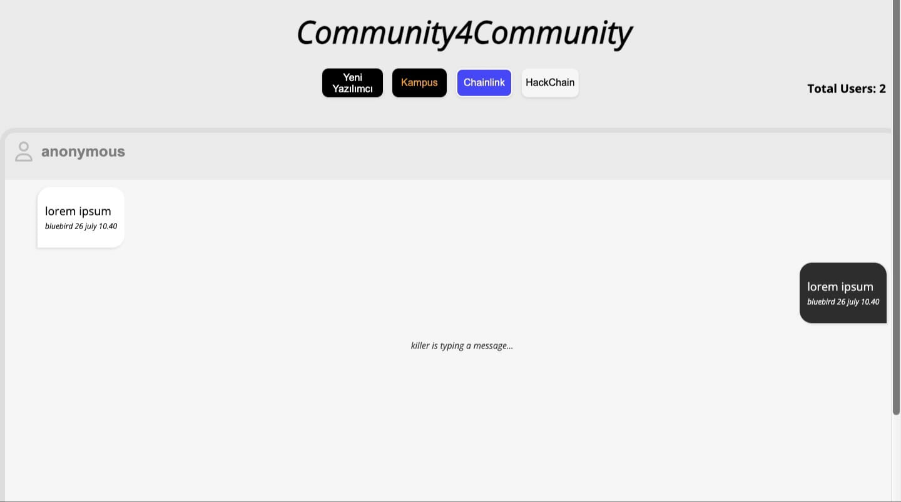

# Community4Community

> Bu projeyi Türkiye'de desteklediğim toplulukların bir araya gelip ortak bir proje üzerinden katkı sağlamaları için oluşturdum. Her topluluk kendi arayüzünü özelleştirebilir, proje arayüzü için eklemeler ve çıkarmalar yapabilir. Projeyi amacından çıkmaması kaydıyla geliştirebilir, istenilen yenilikler için tartışma açabilir.

> Canlı Proje [_here_](https://community4community.vercel.app/).

## İçerik
* [Genel Bilgi](#general-information)
* [Kullanılan Teknolojiler](#technologies-used)
* [Features](#features)
* [Projeye Bakış](#screenshots)
* [Setup](#setup)
* [Kullanım](#usage)
* [Proje Durumu](#project-status)
* [Geliştirme İçin](#room-for-improvement)
* [Bilgilendirme](#acknowledgements)
* [İletişim](#contact)

## Genel Bilgi
- Web Socket projesi
- Chat App

## Kullanılan Teknolojiler
- NodeJS
- Express
- Socket.io

## Features
- İsteğe ve açılan issue'lere bağlı olarak features eklenecektir.

## Projeye Bakış

## Kullanım
Aşağıdaki kod bloğunu çalışma alanınızda terminale yazarsanız projeyi localhost'ta çalıştırabilirsiniz

`npm run dev`

## Proje Durumu
Proje, katkı yapıldığı sürece devam edecektir.

## Geliştirme İçin
Gelişştirmeye Açık Tüm Proje Kapsamlı Sorunlar:
- Arayüz daha iyi bir hale getirilebilir.
- Nickname kısmı düzeltilebilir.

## Bilgilendirme
- Bu proje sadece basit bir web socket chat projesi olacaktı fakat yaptığı işleri beğendiğim toplulukları da projeye dahil etmek istedim.

## İletişim
[Twitter - @busenurcetin16](https://twitter.com/busenurcetin16) tarafından oluşturuldu, dilediğiniz zaman iletişime geçebilirsiniz.

## Topluluk İletişim

[Chainlink](https://twitter.com/ChainlinkTurkey)
[Kampus](https://discord.gg/533xacup)
[Yeni Yazılımcı](https://discord.gg/QSrTWjWqJt)
[HackChain](https://discord.gg/NeQArtxS)

## License 
Bu proje GNU General Public lisansı altında açık kaynak olarak paylaşılmıştır.
